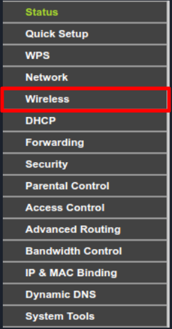
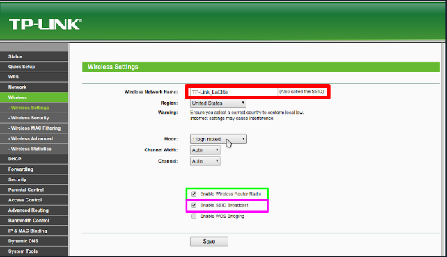
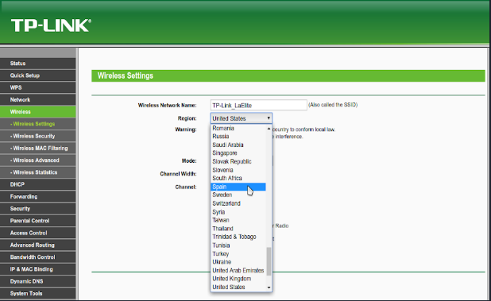
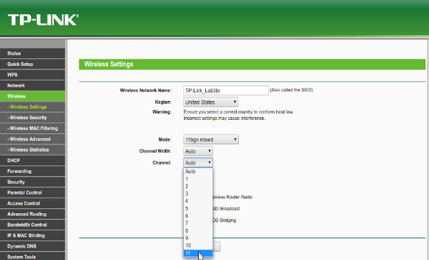
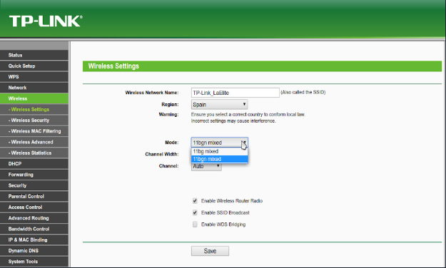

[Index](https://villalba189.github.io/Conf.PA/Index)

# Configuracion de un Punto de Acceso

## 1. Entrar en nuestro Router y Logearnos

Tenemos que meternos en nuestro buscador y poner **192.168.1.1**, asi entraremos a la pagina del ruter.

A continuación pondremos la cuenta de admin y contraseña admin.

## 2. Entramos en los ajustes de Wi-Fi

Entramos en la pestaña de Wireless donde encontraremos toda la configuración del Wi-Fi.

## 3. Opciones Básicas

La **SSID** es el nombre que veremos en los dispositivos para conectarnos.
También existe la BSSID que sería la MAC que tiene el punto de acceso.
(Le hemos puesto la SSID TP-Link_LaElite)

Es para activar el modo wifi y comparta el internet. Lo Activamos

Sirve para que se vea el nombre (SSID) en los dispositivos. Lo Activamos

## 4. Cambiar region

Aquí es donde diremos en qué país nos encontramos, ponemos Spain.

## 5. Canales EU

En España hay como máximo 13 canales como en la mayoria de paises de Europa , donde podemos colocar nuestro Wi-Fi, lo colocaremos en **Auto**, para que el solo encuentre el canal con menos interferencias.

## 6. Otros canales

En United States hay como máximo 11 canales a diferencia EU.

## 7. Banda Ancha

Aquí elegiremos si ponerlo en 1 canal (20MHz) , en 2 (40 MHz) o en **automático (Auto)** que es el que elegiremos .

## 8. Estandares

Elegiremos los estándares **11 bgn mixed**.
Solo se podran entrar los dispositivos con esos mismos  estándares.

